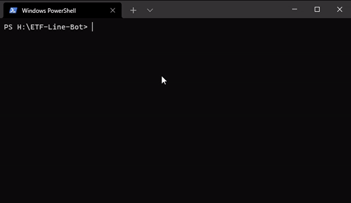

# 📈 ETF-Line-Bot

---


ETF-Line-Bot 為一款可以即時查詢國內所有 ETF 股票即時淨值的 LINE Bot，提供使用快速掌握 ETF 股票的即時淨值資訊(5 分鐘更新)，也可自行設定自選股，讓你輕鬆得知自己關注的 ETF 標的！

本專案僅為個人為了面試所開發的，沒有任何的營利目的，資料來源自[TWSE 臺灣證券交易所](https://mis.twse.com.tw/stock/etf_nav.jsp?ex=tse)，對於任何因數據錯誤，資料不正確所引起的任何損失，概不負責，投資一定有風險，股票投資有賺有賠，申購前應詳閱公開說明書！

## 功能
- 📈 查詢台灣股市目前上市上櫃的所有 ETF，目前約 227 檔。
- 🏦 查詢各大投信所發行的 ETF 股票。
- 🔍 ETF 股票代號查詢，輸入股票代號即可查詢。
- 🔖 ETF 自選股標的的新增或刪除，最多可以儲存 25 檔。

## Demo
新增為 LINE 好友: [https://line.me/R/ti/p/@623wmicb](https://line.me/R/ti/p/@623wmicb)

QR Code:


## 專案目錄
```
.
├── assets                      # LINE Bot 所使用到的圖檔素材
├── controllers
|   ├── follow.controller.js    # 處理 follow 回應事件的判斷流程
|   ├── message.controller.js   # 處理 message 回應事件的判斷流程
|   └── postback.controller.js  # 處理 postback 回應事件的判斷流程
├── database
|   ├── mongodb.js              # Mongo DB 連線處理
|   └── user.js                 # Mongo DB User Collection Schema
├── services
|   └── etf.js                  # 爬取 ETF 資料
├── utils
|   ├── investmentTrustList.js  # 投信清單資料
|   └── messageTemplate.js      # Flex Message 訊息樣板
├── package-lock.json           # NPM 套件版本
├── package.json                # NPM 套件版本
├── app.js                      # 主程式
└── README.md                   # 說明文件
```

## 開發

### 下載

```Shell
$ git clone git@github.com:stu01509/ETF-Line-Bot.git
$ cd ETF-Line-Bot
$ npm install

```

### 環境變數設定

請在當前目錄下新增一個 **.env** 檔案，內容可以照這 **.env.example** 進行修改。

```
channelId = YOUR_CHANNEL_ID                     # LINE CHANNEL ID
channelSecret = YOUR_CHANNEL_SECRET             # LINE CHANNEL SECRET
channelAccessToken = YOUR_CHANNEL_ACCESS_TOKEN  # LINE CHANNEL ACCESS TOKEN
PORT = SERVER_LISTEN_PORT                       # Server 監聽埠號
DB_SSL = USE_SSL_PROTOCOL_TO_CONNECT_DB         # MongoDB 是否使用 SSL 連線 true/false
DB_PATH = DB_ADDRESS                            # MongoDB 連線位置

```

### 啟動

```Shell
$ npm run start
```

